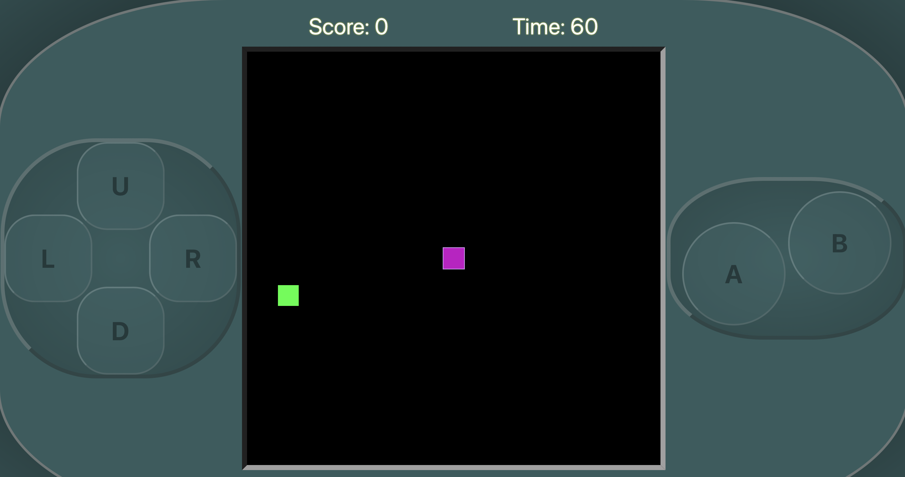

# Snak3r

 ## Link to deployed application/Repository:  
  https://github.com/its-jefe/Project-3

  https://p3-snake.herokuapp.com/

 # Table of contents  
 -[Description](#Description)  
 -[UserStory](#UserStory)  
 -[Badges](#Badges)  
 -[Screenshot](##Screenshot)  
 -[Support](#Support)  
 -[License](#Licence)  

  ## Description:  
  Player controls a creature that roams around picking up items. Each time the creature eats an item, the player gets a point.

  ## User Story:  
  As a user, I want to be able to login to the website and be provided with entertainment. 
  As a player, I want to be able to control my character and pickup items. 
  
  ## Badges:  
  
  
  ## Screenshot:  
 
 
  ## Support:  
  Contact us at Github at:  
  https://github.com/its-jefe 
                           https://github.com/jalmo1 
                           https://github.com/fanidt

  
  ## Licence:  
  MIT  
  License Link: https://opensource.org/licenses/MIT

